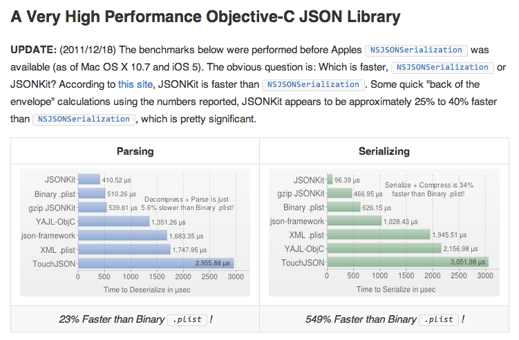
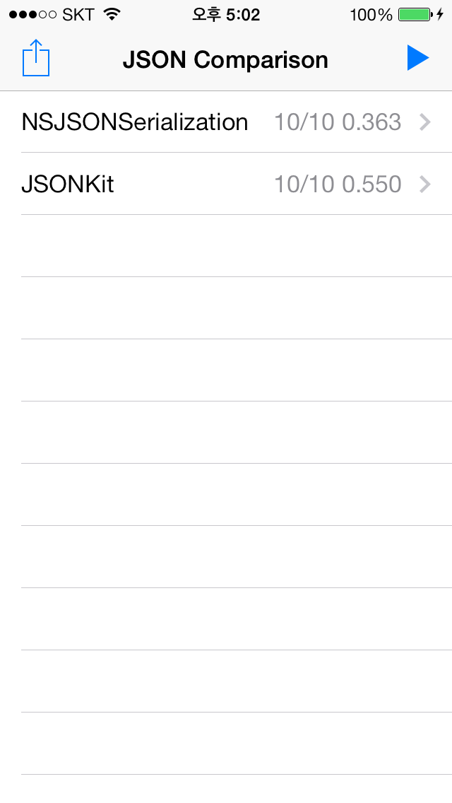
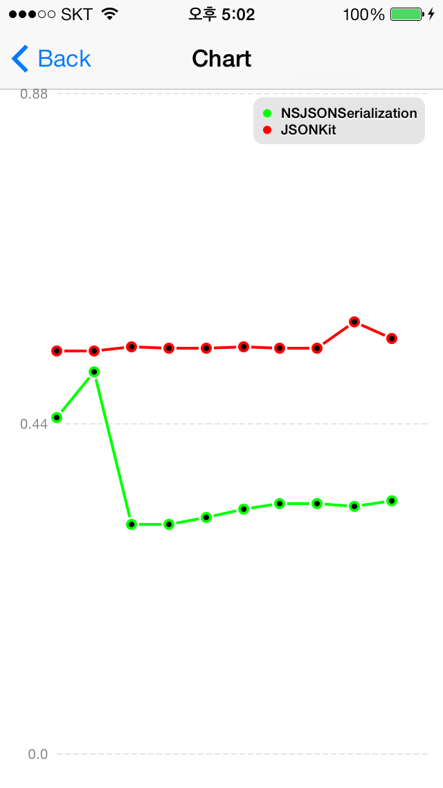

# JSON Parser Comparison

iOS5 이전에 JSON Parser를 제공하지 않았기 때문에 가장 많이 사용하는 라이브러리가 [JSONKit](https://github.com/johnezang/JSONKit)이다.

## 왜 JSONKit 인가?

iOS JSON Parser를 [JSONKit](https://github.com/johnezang/JSONKit)으로 많이 사용한다. 그 이유는 사이트에도 나와있듯 2011년 진행한 테스트 결과 NSJSONSerialization보다 25% ~ 40% 정도의 빠른 성능을 보여준고 있기 때문이다.

## NSJSONSerialization

iOS5 이후 [NSJSONSerialization](https://developer.apple.com/library/ios/documentation/foundation/reference/nsjsonserialization_class/Reference/Reference.html) 이라는 이름으로 제공됨

## 테스트를 진행하는 이유는?

JSONKit은 현재 업데이트가 멈춰있고, Apple은 계속 업데이트 되었기때문에, 
iOS7을 사용하는 지금 아직도 그 결과가 동일할까? 라는 생각에서 테스트를 시작하게 되었다.

### 테스트 방법

1. [json-generator](http://www.json-generator.com/) 이용해서 대용량의 JSON 데이터 (8.8 MB)를 만든다. 
2. 각각의 파서를 사용하여 1에서 생성한 JSON 데이터를 N번을 Serialization하여 Object 형태로 변환한다.
3. 2의 시작, 종료에 시간을 측정하고, 그 차이를 기록한다.

### 제약

병렬 처리가 되지 않도록 시리얼 큐를 사용하여, 순차적으로 수행되록 함.

### 결과

아래와 같이 다양한 단말기에서 확인해보니, NSJSONSerialization이 JSONKit 보다 훨씬 빠르다라는 결론을 얻을 수 있었습니다.

#### NSJSONSerialization이 JSONKit보다 40%이상 더 빠릅니다.

<table>
	<tr>
		<td></td>
		<td>NSJSONSerialization</td>
		<td>JSONKit</td>
	</tr>
	<tr>
		<td>iPhone4 - iOS 6.1</td>
		<td>1.740s</td>
		<td>2.767s</td>
	</tr>
	<tr>
		<td>iPhone5 - iOS 6.1.4</td>
		<td>0.581s</td>
		<td>0.965s</td>
	</tr>
	<tr>
		<td>iPhone5 - iOS 7.0.6</td>
		<td>0.584s</td>
		<td>0.923s</td>
	</tr>
	<tr>
		<td>iPhone5S - iOS 7.0.6</td>
		<td>0.333s</td>
		<td>0.554s</td>
	</tr>
</table>

